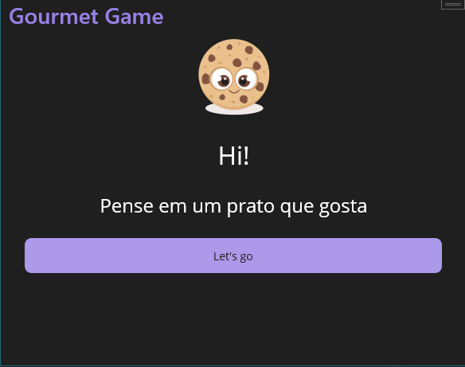
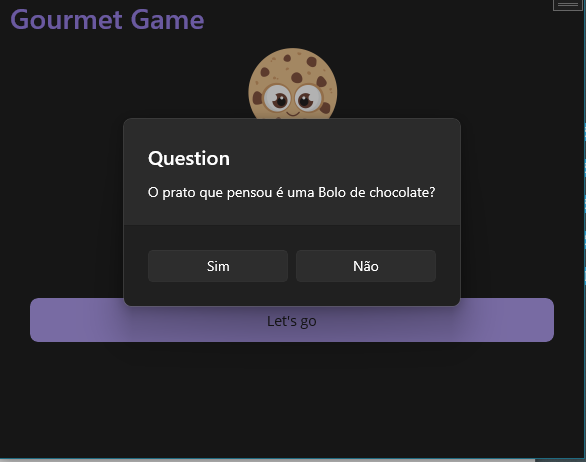
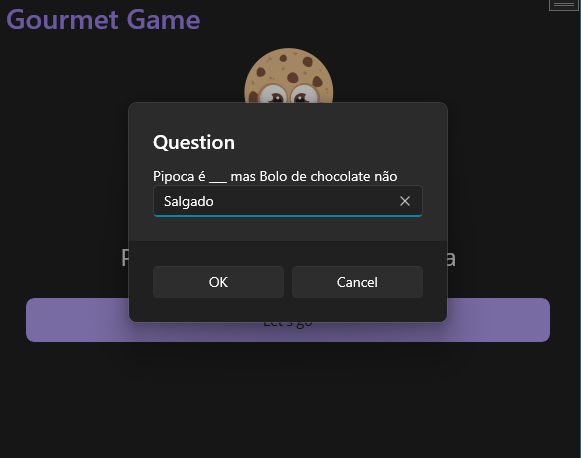
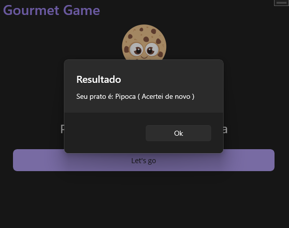

# Gourmet game 
### .NET MAUI

## Objetivo

Mini jogo de advinhação que através de perguntas parametrizadas localiza a comida que o usuário pensou inicialmente. 

## Instalação

- Baixar pacote de instalação [Baixar](https://www.dropbox.com/scl/fi/x13zyupxhyml2iht54ugy/gourmet-game_1.0.1.0_Test.zip?rlkey=a6wc7gq6qmzzl0s26svu3jla0&dl=0)
- Executar o arquivo gourmet-game_1.0.1.0_x86.msix

## Tecnologias e conceitos Utilizadas

Com o intuíto de ser o mais comples possível foi utilizado somente: 

- .NET MAUI - Feito para rodar aplicações multiplataforma
- Git flow - Fluxo de controle de versionamento respeitando método desenvolvido pelo time [atlassian](https://www.atlassian.com/git/tutorials/comparing-workflows/gitflow-workflow)
- Programação orientada a objeto 
- Injeção de dependência
- Conceito de [IoC](https://learn.microsoft.com/en-us/dotnet/architecture/modern-web-apps-azure/architectural-principles#dependency-inversion)

## Referências para desenvolvimento
- [.NET MUAI Componentes](https://learn.microsoft.com/en-us/dotnet/maui/user-interface/pop-ups?view=net-maui-8.0)

## Projeto

|||
|:----------------:|:----------------:|
|||
|||

